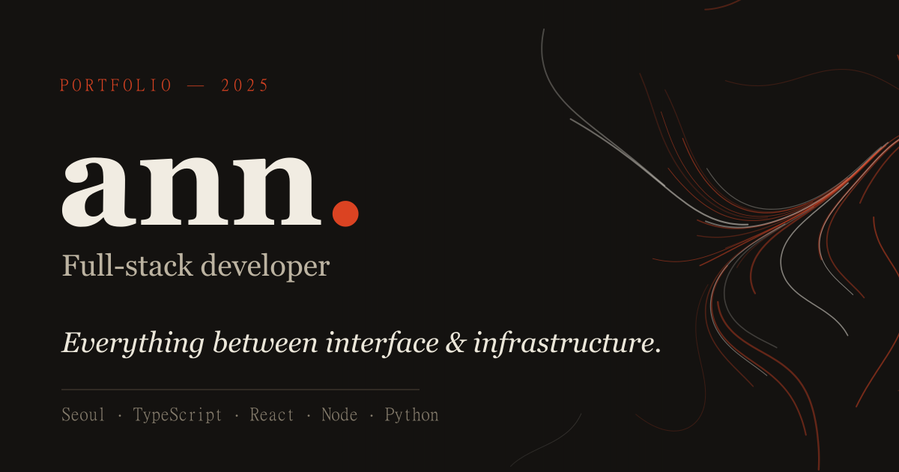

<div align="center">

# ann — 포트폴리오

**인터페이스와 인프라 사이의 모든 것을 만드는 풀스택 개발자의 작업과 글.**

[**→ lamgul.github.io**](https://lamgul.github.io/)  ·  React · TypeScript · Node · Python



</div>

---

프레임워크 없이 손으로 짠 정적 사이트(허브·글)와, 각자 다른 스택으로 만든
다섯 개의 인터랙티브 프로젝트로 이뤄져 있습니다. GitHub Pages 한 곳에서
전부 돌아가되, 백엔드가 필요한 프로젝트는 실제 서버 코드를 함께 담고
정적 배포본에서는 브라우저 안 시뮬레이터로 살아 움직입니다.

## 프로젝트

| # | 프로젝트 | 한 줄 | 스택 |
|---|----------|-------|------|
| 01 | [활자 실험실](projects/type-playground/) | 가변 폰트 5축을 실시간으로 만지는 타이포그래피 도구 | Vanilla JS · Variable Fonts |
| 02 | [살아있는 투표](projects/livepoll/) | DB 없이 메모리+WebSocket으로 도는 실시간 투표 | React · Express · Socket.IO · TS |
| 03 | [정규식 철길](projects/rail/) | 정규식을 파싱해 철도 다이어그램으로 그리는 도구 | TypeScript · SVG (의존성 0) |
| 04 | [새벽의 커밋](projects/commit-rhythm/) | 3년치 커밋으로 그린 코딩 리듬 데이터 스토리 | D3.js · SVG |
| 05 | [흐름](projects/flowfield/) | 값 노이즈 벡터장 위를 흐르는 제너러티브 캔버스 | Canvas 2D (의존성 0) |

각 프로젝트 폴더에 개별 README와 회고 글이 있습니다.
글만 모아 보려면 → [writing/](writing/).

## 눈여겨볼 점

- **트랜스포트 추상화** — Livepoll의 클라이언트는 자기가 진짜 Socket.IO와
  말하는지 브라우저 안 시뮬레이터와 말하는지 모릅니다. 그 한 겹 덕분에 같은
  빌드가 개발 땐 라이브로, Pages에선 자급자족 데모로 돕니다.
- **손으로 짠 파서** — Rail의 재귀 하강 파서와 철도 레이아웃 엔진은 라이브러리
  없이 밑바닥부터. 수량자는 합성으로 나옵니다(`* = optional∘oneOrMore`).
- **테마를 따라오는 데이터 시각화** — 색을 절대값으로 박지 않고 `fill-opacity`만
  얹어, 라이트/다크 전환에 다시 그리지 않고 대응합니다.
- **프레임워크 0의 허브** — 랜딩·소개·글은 순수 HTML/CSS/JS. 디자인 토큰,
  다크 모드, 스크롤 리빌, 커서 추적 프리뷰까지 직접.

## 로컬에서 보기

정적 부분은 아무 정적 서버로:

```bash
python -m http.server 8000     # → http://localhost:8000
```

빌드가 필요한 프로젝트:

```bash
# Livepoll — 진짜 실시간(다중 접속)으로 돌리기
cd projects/livepoll/server && npm i && npm run dev
cd projects/livepoll/web && npm i && echo "VITE_SERVER_URL=http://localhost:4000" > .env && npm run dev

# Rail — TS 파서 컴파일
cd projects/rail && npm i && npm run build
```

## 구조

```
├── index.html            허브 (에디토리얼 랜딩)
├── about.html            소개 · 이력
├── writing/              개발 기록 3편
├── projects/
│   ├── type-playground/  가변 폰트 도구
│   ├── livepoll/         server(Express) · web(React) · app(빌드본)
│   ├── rail/             src(TS) · dist(컴파일본)
│   ├── commit-rhythm/    D3 데이터 스토리 + data.json
│   └── flowfield/        캔버스 제너러티브
└── assets/               css(디자인 시스템) · js · fonts · img
```

## 콜로폰

Fraunces · Inter · JetBrains Mono(자체 호스팅), 한글은 Pretendard.
분석 도구 없음, 쿠키 없음. 서울에서 손으로 짬.

<div align="center"><sub>© 2025 ann · <a href="mailto:asj2767@gmail.com">asj2767@gmail.com</a></sub></div>
